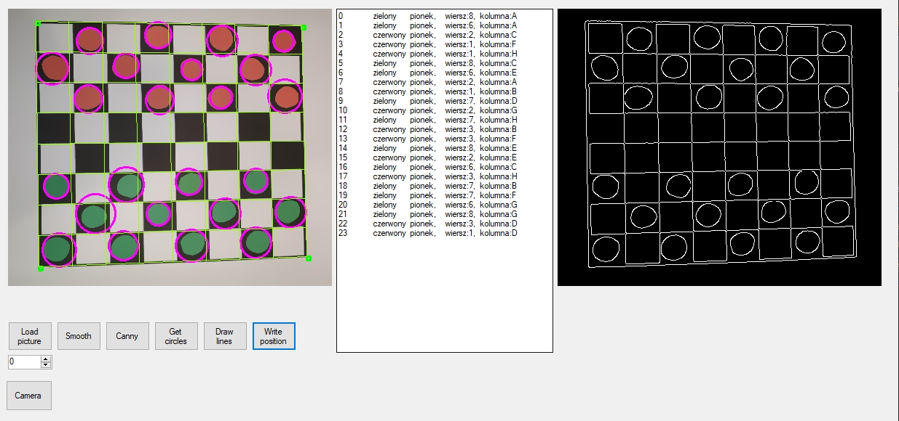
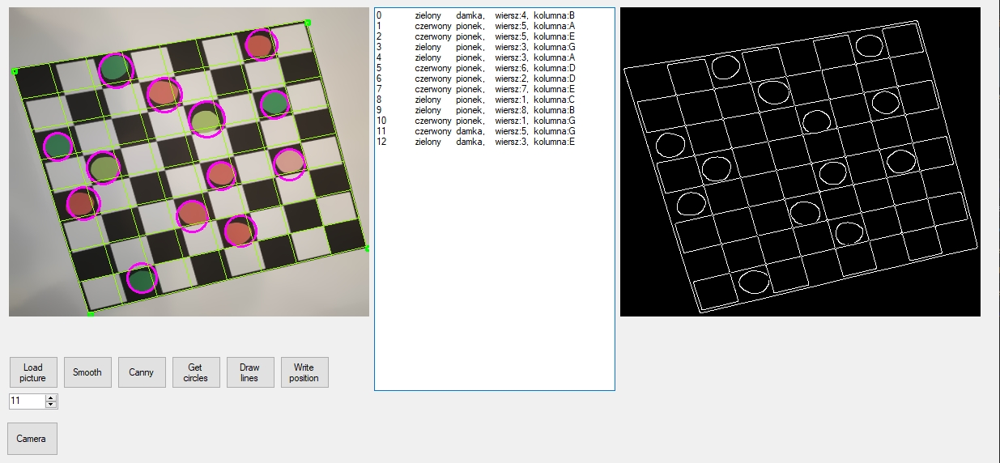

# Checkers-Machine-vision
To build you need to install and import <a href="https://github.com/emgucv/emgucv/releases/tag/4.1.1">EmguCV libraries </a> to project (project/add existing items -> /libs/x64/).

For the 8x8 board, the vision system determines the current state of the arrangement of pawns and describes it in the form of a list view.

Smoothing the image using the Smooth Bilateral function  
Edge detection by canny function  
Pawns detection with HoughCircles function  
Kings detection by color differences  

